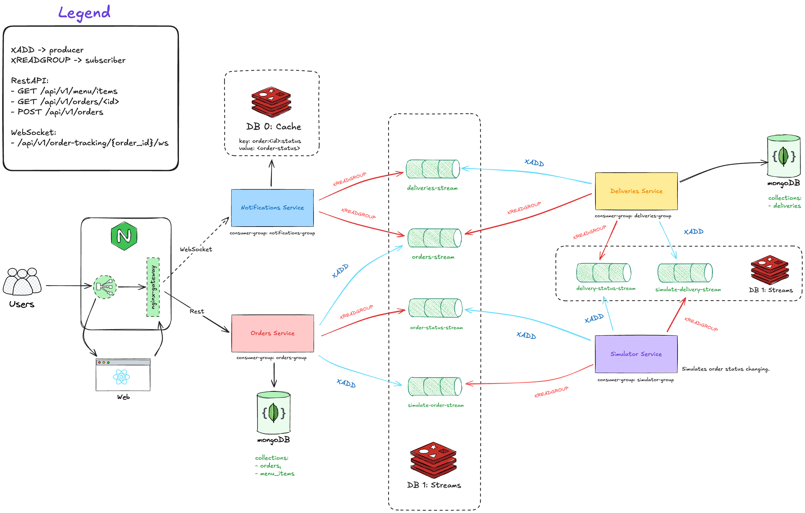

## Kubernetes microservices project, SAGA pattern

---
### **Services Flow Draft:**  

---

### TODO:
0. Implement CQRS and Event sourcing instead of saga lol
1. Clear cache using CronJob.
2. Connect Elasticsearch to the project.

### For the future:
1. Add **XPENDING + XCLAIM** to the Redis Consumers.

