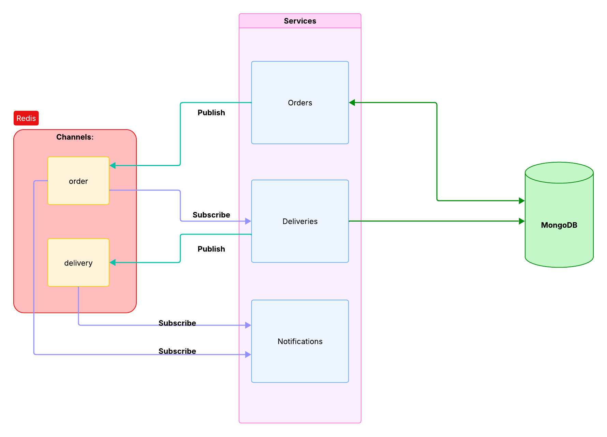

## Kubernetes microservices project

---
### **Services Flow Draft:**  
### **DEPRECATED FLOW**  

---

### TODO:
1. Clear cache using CronJob.
2. Make a new flow diagram.
3. Connect Elasticsearch to the project.

### For the future:
1. Add **XPENDING + XCLAIM** to the Redis Consumers.

