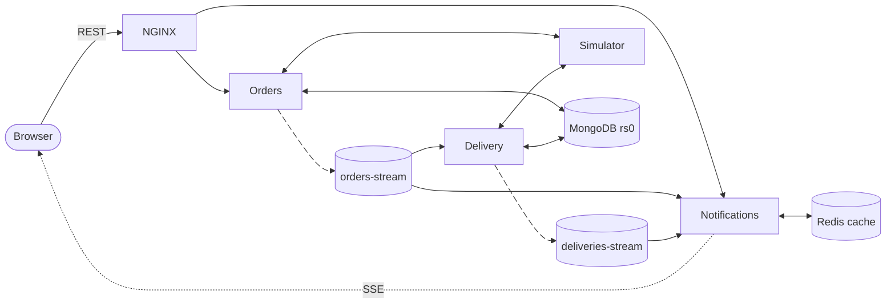
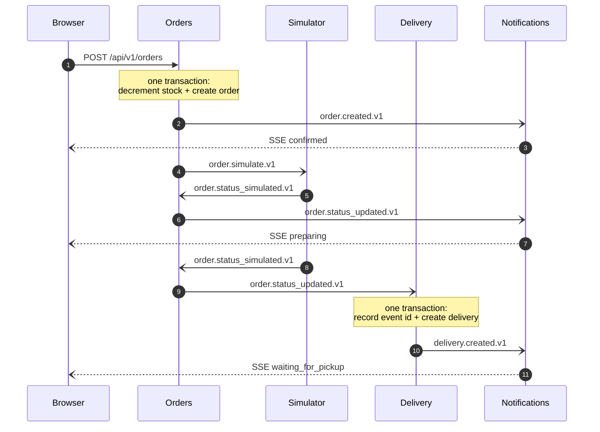

# Orders Project

Event-driven food delivery system. **FastAPI + MongoDB + Redis Streams**, React frontend, deployed on a self-hosted Raspberry Pi Kubernetes cluster at [orders.karolmarszalek.me](https://orders.karolmarszalek.me/).

No orchestrator and no inter-service calls: every service reacts to events on Redis Streams and emits its own.

## Architecture


```mermaid
flowchart LR
    B(["Browser"])
    NG["NGINX"]

    B -->|REST| NG
    NG --> O["Orders"]
    NG --> N["Notifications"]
    N -.->|SSE| B

    O e1@--> OS[("orders-stream")]
    OS --> D["Delivery"]
    OS --> N
    D e2@--> DS[("deliveries-stream")]
    DS --> N

    O <--> SIM["Simulator"]
    D <--> SIM

    O <--> M[("MongoDB rs0")]
    D <--> M
    N <--> R[("Redis cache")]

    e1@{ animate: true }
    e2@{ animate: true }
```

Order tracking is one-way, so it uses **server-sent events** rather than a WebSocket: covered by CORS, reconnects natively, no application heartbeat.

## Order lifecycle


```mermaid
sequenceDiagram
    autonumber
    participant B as Browser
    participant O as Orders
    participant S as Simulator
    participant D as Delivery
    participant N as Notifications

    B->>O: POST /api/v1/orders
    Note over O: one transaction:<br/>decrement stock + create order
    O-)N: order.created.v1
    N--)B: SSE confirmed
    O-)S: order.simulate.v1

    S-)O: order.status_simulated.v1
    O-)N: order.status_updated.v1
    N--)B: SSE preparing

    S-)O: order.status_simulated.v1
    O-)D: order.status_updated.v1
    Note over D: one transaction:<br/>record event id + create delivery
    D-)N: delivery.created.v1
    N--)B: SSE waiting_for_pickup
```

Events are versioned classes in `shared/events`; the class owns its stream and wire type, and consumers dispatch per message on `event_type`.

## Reliability

| Concern | Mechanism |
|---|---|
| Overselling | Stock decrement and order insert share one MongoDB transaction |
| Lost events | Publish failures raise; nothing reports success on a dropped event |
| Duplicate deliveries | Inbox: event id recorded in the same transaction as the write |
| Poison messages | 3 retries, then the `dead-letters` stream |
| Dead consumers | Readiness fails and the process exits, so Kubernetes restarts it |
| Unbounded growth | `MAXLEN` on every stream, TTL on inbox records |

## Quick Start

```bash
./scripts/setup.sh        # generates envs/mongo-keyfile
docker compose up --build
```

[localhost](http://localhost) for the app, [localhost/dev](http://localhost/dev) for Grafana, Prometheus and API docs.

## Development

```bash
uv sync --all-packages --dev   # single workspace, one lockfile
uv run ruff check && uv run ty check
cd orders && uv run pytest
```

## Documentation

Full docs at [docs.orders.karolmarszalek.me](https://docs.orders.karolmarszalek.me/) --
[Getting Started](https://docs.orders.karolmarszalek.me/getting-started.html) ·
[Architecture](https://docs.orders.karolmarszalek.me/architecture.html) ·
[Services](https://docs.orders.karolmarszalek.me/services.html) ·
[Monitoring](https://docs.orders.karolmarszalek.me/monitoring.html) ·
[Deployment](https://docs.orders.karolmarszalek.me/deployment.html) ·
[Development](https://docs.orders.karolmarszalek.me/development.html)

## Author

Made with **beer** by **kkaarroollm** -- [website](https://karolmarszalek.me/)
