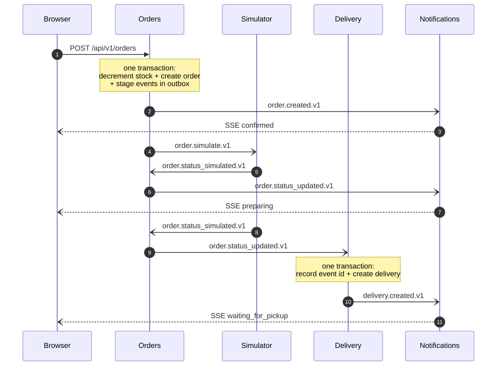

# Orders Project

Event-driven food delivery system. **FastAPI + MongoDB + Redis Streams**, React frontend, deployed on a self-hosted Raspberry Pi Kubernetes cluster at [orders.karolmarszalek.me](https://orders.karolmarszalek.me/).

No orchestrator and no inter-service calls: every service reacts to events on Redis Streams and emits its own.

## Architecture


```mermaid
flowchart LR
    B(["Browser"])
    NG["NGINX"]

    B -->|REST| NG
    NG --> O["Orders"]
    NG --> N["Notifications"]
    N -.->|SSE| B

    O --> OS[("orders-stream")]
    OS --> D["Delivery"]
    OS --> N
    D --> DS[("deliveries-stream")]
    DS --> N

    O <--> SIM["Simulator"]
    D <--> SIM

    O <--> M[("MongoDB rs0")]
    D <--> M
    N <--> R[("Redis cache")]
```

Order tracking is one-way, so it uses **server-sent events** rather than a WebSocket: covered by CORS, reconnects natively, no application heartbeat.

## Order lifecycle


```mermaid
sequenceDiagram
    autonumber
    participant B as Browser
    participant O as Orders
    participant S as Simulator
    participant D as Delivery
    participant N as Notifications

    B->>O: POST /api/v1/orders
    Note over O: one transaction:<br/>decrement stock + create order<br/>+ stage events in outbox
    O-)N: order.created.v1
    N--)B: SSE confirmed
    O-)S: order.simulate.v1

    S-)O: order.status_simulated.v1
    O-)N: order.status_updated.v1
    N--)B: SSE preparing

    S-)O: order.status_simulated.v1
    O-)D: order.status_updated.v1
    Note over D: one transaction:<br/>record event id + create delivery
    D-)N: delivery.created.v1
    N--)B: SSE waiting_for_pickup
```

Events are versioned classes in `shared/events`; the class owns its stream and wire type, and consumers dispatch per message on `event_type`.

## Reliability

| Concern | Mechanism |
|---|---|
| Overselling | Stock decrement and order insert share one MongoDB transaction |
| Lost events | Outbox: events staged in the writing transaction, relayed after commit |
| Duplicate deliveries | Inbox: event id recorded in the same transaction as the write |
| Poison messages | 3 retries, then the `dead-letters` stream |
| Dead consumers | Readiness fails and the process exits, so Kubernetes restarts it |
| Unbounded growth | `MAXLEN` on every stream, TTL on inbox and idempotency records |
| Duplicate orders | `Idempotency-Key`: retry returns the original result |

## Quick Start

```bash
./scripts/setup.sh        # generates envs/mongo-keyfile
docker compose up --build
```

[localhost](http://localhost) for the app, [localhost/dev](http://localhost/dev) for Grafana, Prometheus and API docs.

## For developers

### One workspace, one lockfile

Five Python packages in a single [uv workspace](https://docs.astral.sh/uv/concepts/projects/workspaces/),
resolved together into **one `uv.lock` and one `.venv` at the repo root**. Members
must not carry their own lockfile — that is what a workspace exists to prevent.

```bash
uv sync --all-packages --dev   # installs every member
uv run ruff check              # config lives once, at the root
uv run ty check
cd orders && uv run pytest
```

Third-party versions are pinned **once**, in `shared/pyproject.toml`. Services
declare no versions of their own, so they cannot drift apart.

### The packages

| Package | Role |
|---|---|
| `shared` | Events, stream bus, outbox/inbox, scheduler, Mongo repository, logging, metrics |
| `orders` | REST API, stock and order transactions, outbox relay |
| `delivery` | Reacts to orders, owns deliveries |
| `notifications` | SSE endpoint, snapshot cache, per-replica fanout |
| `simulator` | Drives orders through their lifecycle via durable timers |

`shared` is a real package, not a folder of helpers: it holds the parts where a
subtle mistake is expensive and should be made once — the delivery guarantees,
the event contracts, the transaction manager. Services import it as a workspace
dependency, so a change is type-checked against every consumer immediately.

Its extras keep each image free of drivers it never imports:

| Extra | Pulls in | Used by |
|---|---|---|
| `mongo` | `pymongo` | orders, delivery |
| `web` | `fastapi[standard]`, `starlette` | orders, delivery, notifications |
| *(none)* | `redis`, `pydantic`, `prometheus-client` | simulator |

```toml
# orders/pyproject.toml
dependencies = ["shared[mongo,web]"]

[tool.uv.sources]
shared = { workspace = true }
```

### Tests

Unit tests run anywhere. Tests whose guarantee depends on real infrastructure —
a unique index aborting a transaction, a Lua claim racing two consumers — skip
locally and run in CI against a real MongoDB replica set and Redis:

```bash
INTEGRATION_MONGO_URL=... uv run pytest tests/test_outbox_integration.py
```

## Documentation

[docs.orders.karolmarszalek.me](https://docs.orders.karolmarszalek.me/) — the
[design notes](https://docs.orders.karolmarszalek.me/design.html): why it is
built this way, what it guarantees, and where it breaks first.

## Author

Made with **beer** by **kkaarroollm** -- [website](https://karolmarszalek.me/)
