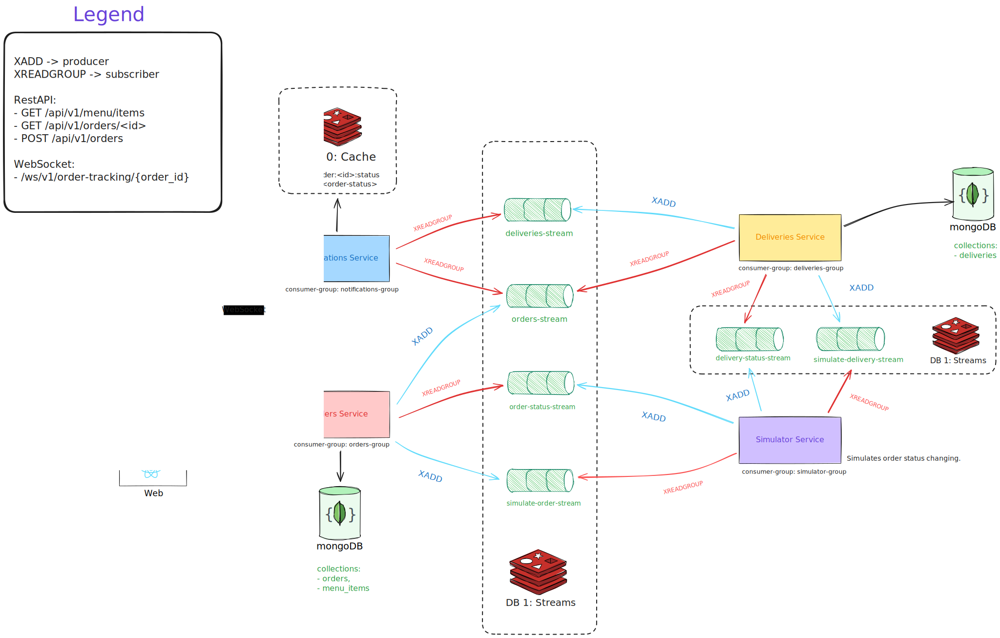
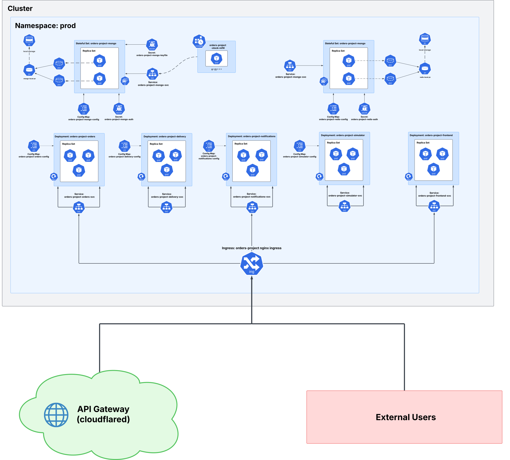

# 🧙🏻‍♂️ Orders Project – Microservices Architecture

> A complete microservices-based architecture built with FastAPI + MongoDB + Redis, supporting Kubernetes and Docker Compose environments. The project includes a simulated order lifecycle and event-stream communication between services. 
> 
> Deployed on my **self-hosted** Kubernetes cluster running on a **Raspberry Pi**, using Ingress NGINX and a Cloudflared tunnel for secure public access at [orders.karolmarszalek.me](https://orders.karolmarszalek.me/).
---

## 👽 System Architecture Overview

### 🦕 Service Communication & Stream Architecture



This system follows a SAGA Pattern for managing distributed transactions across microservices. Services communicate primarily over REST, Web Sockets, and Redis Streams to track and coordinate the order lifecycle. Redis acts as an event bus for both real-time messaging and data decoupling.

The design allows extensibility (e.g., adding new consumers or data pipelines) and cleanly separates responsibilities into domain-driven services. Each service loads its configuration from environment files and connects to MongoDB and Redis.


### ☸️ Kubernetes Deployment Architecture



The Kubernetes setup includes Deployments, StatefulSets (Mongo & Redis), ConfigMaps, Secrets, Ingress NGINX with the Cloudflared tunnel, and a CronJob for stock refilling. Each microservice is deployed as a dedicated Kubernetes deployment with a corresponding ClusterIP service.

Three Helm-based init jobs run automatically upon the first deployment:

- **`init-rs-job.yaml`**: Initializes MongoDB replica set (`rs0`) – extendable, depends on your resources and needs.
     
- **`init-user-job.yaml`**: Creates the initial MongoDB admin user.
    
- **`init-dummy-db-job.yaml`**: Loads demo data into Mongo.
    

All configurable values (envs, secrets, image tags) can be set in the Helm `values.yaml` in the main chart and its subcharts.

A scheduled **CronJob** runs every 2 hours to simulate stock refill.

---

## ⚙️ Tech Stack

### Backend (Python)

- **FastAPI** – for building async REST APIs
    
- **Pydantic / pydantic-settings** – for schema validation & env config
    
- **Motor** – async MongoDB client
    
- **Redis** – pub/sub messaging system
    

**Dev tooling:**

- `mypy`, `ruff`
    

### Frontend (React)

- **React 19** + **TypeScript**
    
- **Vite** for lightning-fast build & dev
    
- **Tailwind CSS** + `shadcn/ui` components
    
- **TanStack Query & Router**
    
- **Framer Motion** – for animations
    
- **Zod** – schema validation
    
- **ESLint + Prettier** – code quality
    

---

## 🐳 Docker Compose (local dev setup)

Requirements:

- Docker + Docker Compose installed
    
- Environment files copied into `envs/` (remove `default.` prefix):
    
    - `mongo_db.env`, `redis.env`, `simulator.env`, `mongo-keyfile`
        

### ✅ Startup command:

```bash
cp envs/default.mongo_db.env envs/mongo_db.env
cp envs/default.redis.env envs/redis.env
cp envs/default.simulator.env envs/simulator.env
cp envs/default.mongo-keyfile envs/mongo-keyfile

docker compose up --build
```

> Frontend available at: [http://localhost:3000](http://localhost:3000/)

---

## ☸️ Kubernetes (Helm deployment)

### 📦 Install using Helm:

```bash
helm install orders ./charts/orders-project
```

Make sure to configure your own secrets, user credentials, and connection strings in the `values.yaml` files across the main chart and subcharts.

On first installation, three `Job` resources are triggered:

- Initializes Mongo replica set (1-node by default)
    
- Creates initial database user
    
- Loads test data into the database
    

Includes:

- Ingress (NGINX)
    
- StatefulSets for MongoDB and Redis
    
- CronJob `stock-refill` that periodically replenishes item stock
    

---

## 🧩 Microservices Overview

| Name                     | Port  | Description                                         |
|--------------------------|-------|-----------------------------------------------------|
| `order-service`          | 8003  | Processes customer orders                           |
| `delivery-service`       | 8001  | Handles shipment and delivery status                |
| `notifications-service`  | 8002  | Sends updates via Web Socket                        |
| `order-simulator`        | -     | Simulates order lifecycle from creation to delivery |
| `frontend`               | 3000  | React UI built with modern tooling                  |
| `mongo`                  | 27017 | MongoDB replicas                                    |
| `redis`                  | 6379  | Redis for streaming                                 |
| `stock-refill` (CronJob) | -     | Periodically refills inventory stock                |

---

## 📁 Project Structure

```plaintext
.
├── frontend/               # React + TS + Tailwind UI
├── orders/                 # FastAPI – orders service
├── delivery/               # FastAPI – delivery logic
├── notifications/          # FastAPI – notifications + Redis
├── simulator/              # Just Python and streams – generates synthetic events
├── charts/                 # Helm chart & init jobs
├── envs/                   # All .env files required
├── scripts/init-replica.sh # Replica init script (Docker)
├── assets/*.png            # Diagrams
└── docker-compose.yaml     # Dev-only deployment stack
```

---

## ✅ TODO

- [ ]  Implement CQRS and Event Sourcing
    
- [ ]  Logging & monitoring (Prometheus, Grafana)—a log format is ready.
    
- [ ]  Set up cache invalidation via CronJob
    
- [ ]  Enhance Redis Stream consumers with XPENDING + XCLAIM logic

- [ ]  UNIT tests for all services 
    


## 🍺 Author

Made with **beer** by: **kkaarroollm** → [website](https://karolmarszalek.me/)  

Built with: FastAPI, Redis, MongoDB, React, Helm, Docker Compose

