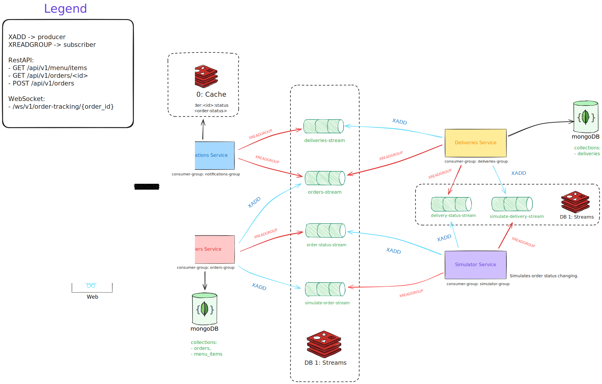
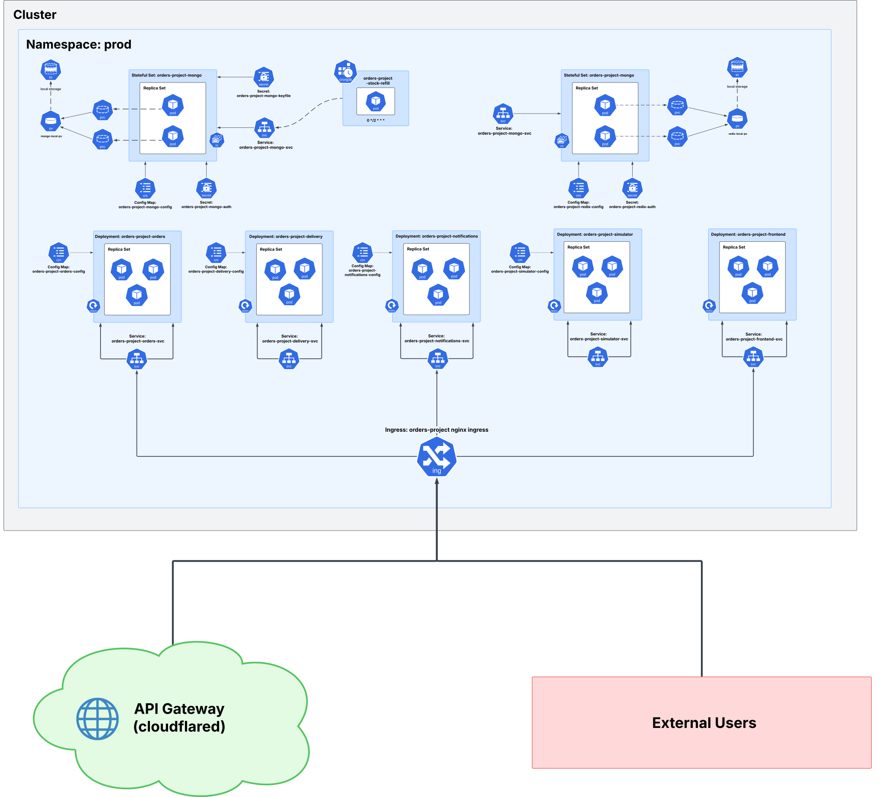

# Architecture

## Service Communication



The system follows the **SAGA pattern** for distributed transactions across microservices. Services communicate over:

- **REST APIs** for synchronous requests (order creation, menu queries)
- **Redis Streams** for asynchronous event-driven messaging (order lifecycle)
- **WebSockets** for real-time order tracking updates to the frontend

Redis acts as the event bus. Each service publishes domain events and subscribes to relevant streams through consumer groups.

### Stream Flow

```
Order placed
  -> orders-stream (order.created)
     -> delivery-group: creates delivery
     -> notifications-group: stores status

  -> simulate-order-stream (order.simulate)
     -> simulator-group: starts lifecycle simulation

Delivery status change
  -> delivery-status-stream
     -> delivery-group: updates delivery record

  -> deliveries-stream
     -> notifications-group: pushes to WebSocket

Order status change
  -> order-status-stream
     -> orders-group: updates order record
```

### Message Envelope

All stream messages are wrapped in a `MessageEnvelope`:

```python
{
    "event_type": "order.created",
    "correlation_id": "uuid",
    "source": "orders",
    "timestamp": "2024-01-01T00:00:00Z",
    "payload": { ... }
}
```

The `correlation_id` enables end-to-end tracing across services through Loki logs.

## Kubernetes Deployment



The Kubernetes setup uses an umbrella Helm chart with:

- **Deployments** for all application services (3 replicas each)
- **StatefulSets** for MongoDB (replica set) and Redis (persistent)
- **Ingress NGINX** with Cloudflared tunnel for public access
- **CronJob** for periodic stock refill
- **kube-prometheus-stack** for monitoring
- **Loki + Promtail** for log aggregation

Three init Jobs run on first deployment:

1. **init-rs-job** -- initializes MongoDB replica set
2. **init-user-job** -- creates MongoDB admin user
3. **init-dummy-db-job** -- loads demo data
