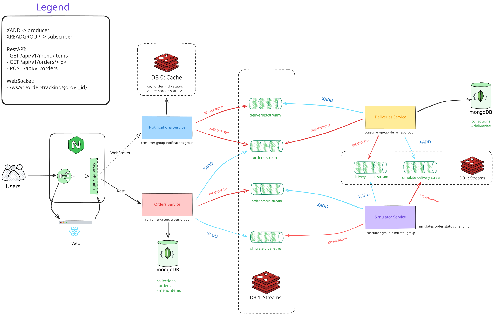
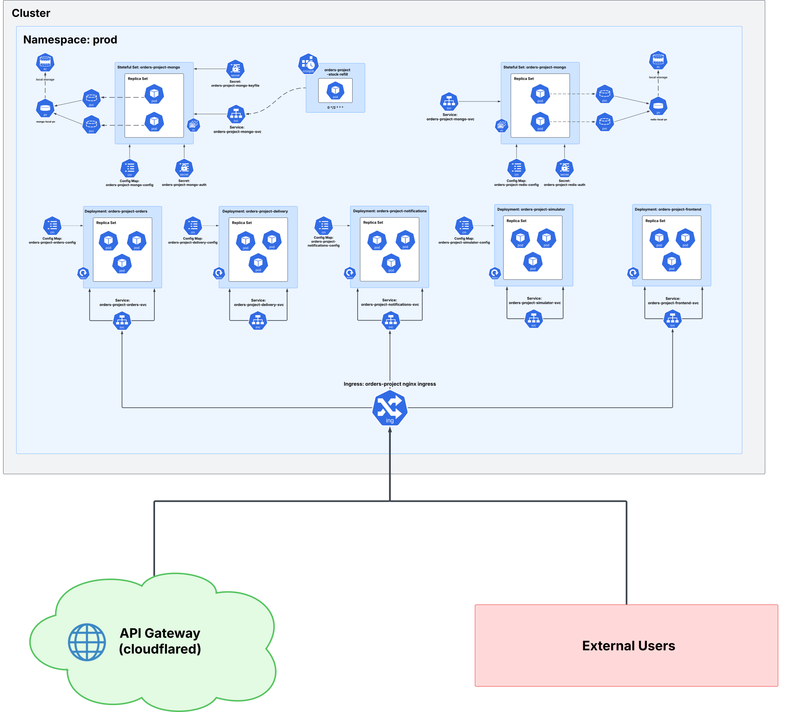

# Architecture

## Design Patterns at a Glance

| Pattern | Where | Why |
|---------|-------|-----|
| **Event-Driven Choreography** | Inter-service communication | No central orchestrator -- services react independently to domain events |
| **Consumer Groups** | Redis Streams consumers | Load-balanced message distribution across pod replicas |
| **Dead-Letter Queue** | Stream consumer retry logic | Isolates poison messages after 3 failed attempts |
| **Envelope Pattern** | All stream messages | Correlation ID propagation for distributed tracing without Jaeger/Zipkin |
| **Repository Pattern** | `shared/db/repository.py` | Generic async CRUD abstraction over MongoDB with type safety |
| **Transaction Manager** | `shared/db/mongo.py` | Context-managed sessions for atomic multi-document operations |
| **Strategy Pattern** | Simulator service | Pluggable simulation strategies per entity type (order vs delivery) |
| **API Gateway** | NGINX reverse proxy | Single entry point with rate limiting, SSE stream passthrough, security headers |
| **Transactional Outbox** | Order creation flow | Events are staged in the same transaction as the write, then relayed |
| **Inbox / Dedup** | Delivery consumer | Event id recorded in the business transaction, so redelivery is a no-op |

---

## Design Patterns & Principles

### Event-Driven Choreography

The system uses **choreography** over orchestration -- there is no central coordinator managing workflows. Each service independently reacts to domain events published on Redis Streams and emits its own events in response.

This means:

- **Zero inter-service REST calls.** Services never call each other directly. The only REST endpoints face the client (browser).
- **Loose coupling.** Adding a new consumer (e.g., an analytics service) requires zero changes to existing services -- just subscribe to the relevant stream.
- **Independent deployability.** Any service can be restarted or redeployed without breaking the pipeline.

### Why Not SAGA?

A SAGA pattern implies a coordinator (orchestrator) or explicit compensation logic to undo steps on failure. This system doesn't have either -- if an event fails processing, it's retried and eventually moved to a dead-letter queue. The tradeoff: simpler implementation, but no automatic rollback across services.

### Transactional Outbox

The order service never publishes directly. Events are staged in an `outbox`
collection inside the same transaction that writes the order, so the event is
part of the commit rather than a second write that can fail on its own:

```python
async with transaction() as session:
    await menu_repo.decrement_stock(item_id, quantity, session)
    order_id = await order_repo.create(order_data, session)
    await outbox.add(OrderCreated(...), session)   # same transaction
```

A relay then moves staged rows onto Redis Streams. It watches a MongoDB change
stream for low latency and sweeps for unpublished rows every 30 seconds. The
sweep is what makes it correct -- it covers a relay that was down, a publish
that failed, and a resume token that aged out of the oplog -- so the change
stream is only a latency optimisation.

Publishing is therefore **at-least-once**: the relay can publish and then crash
before marking the row. Republished events carry their original `event_id`,
which is what the consumer inbox deduplicates on.

### Inbox Deduplication

The delivery service records each `event_id` it applies in the same transaction
as the delivery it creates. A redelivered event hits a unique index, aborts the
transaction, and leaves no second delivery. At-least-once delivery plus the
inbox gives effectively-once processing.

Order status updates and notification broadcasts are idempotent by
construction, so they carry no inbox.

---

## System Overview



### Communication Protocols

| Layer | Protocol | Purpose |
|-------|----------|---------|
| Client ↔ API | **REST** (HTTP/1.1) | Order creation, menu queries |
| Client → Notifications | **Server-sent events** | Real-time order tracking, one-way, native reconnect |
| Service ↔ Service | **Redis Streams** | Async event-driven messaging with consumer groups |
| Service ↔ MongoDB | **Wire Protocol** | ACID transactions over replica set |

No gRPC, no GraphQL, no WebSockets -- intentionally simple protocol choices.
Order tracking is one-way, so it uses SSE rather than an upgrade handshake.

---

## Redis Streams as an Event Bus

Redis Streams provide a **persistent, ordered, append-only log** with consumer group semantics -- similar in concept to Kafka topics and consumer groups, but embedded in Redis.

### Why Redis Streams Over Alternatives?

| Feature | Redis Streams | Redis Pub/Sub | RabbitMQ | Kafka |
|---------|:---:|:---:|:---:|:---:|
| Message persistence | ✅ | ❌ | ✅ | ✅ |
| Consumer groups | ✅ | ❌ | ✅ | ✅ |
| Message acknowledgment | ✅ | ❌ | ✅ | ✅ |
| Replay from offset | ✅ | ❌ | ❌ | ✅ |
| Already in the stack | ✅ | ✅ | ❌ | ❌ |
| Operational complexity | Low | Low | Medium | High |

Redis was already needed for caching. Streams add event bus capabilities without introducing another infrastructure component.

### Consumer Group Mechanics

Each service registers a **consumer group** on the streams it cares about:

```
XREADGROUP GROUP orders-group consumer-1 COUNT 10 BLOCK 5000 STREAMS orders-stream >
```

- `GROUP orders-group` -- the consumer group name (one per service)
- `consumer-1` -- individual consumer within the group (one per pod/replica)
- `COUNT 10` -- batch size per read
- `BLOCK 5000` -- block for 5 seconds if no new messages
- `>` -- only read new (unacknowledged) messages

After successful processing, the message is acknowledged:

```
XACK orders-stream orders-group <message-id>
```

### Retry & Dead-Letter Queue

Unacknowledged messages are automatically reclaimed after a timeout using `XAUTOCLAIM`. A retry counter tracks attempts per message:

```
Message fails processing
  → stays in pending entries list (PEL)
  → XAUTOCLAIM reclaims it after idle timeout
  → retry counter incremented (stored in Redis key)
  → if retries > max_retries → XADD to dead-letters stream
```

The dead-letter stream preserves the original message, stream name, group, and error information for manual inspection.

### Message Envelope

Every event is wrapped in a standardized envelope:

```
{
  "event_type": "order.created",
  "correlation_id": "550e8400-e29b-41d4-a716-446655440000",
  "source": "orders-service",
  "timestamp": "2024-12-01T14:30:00Z",
  "payload": { "order_id": "...", "items": [...] }
}
```

The `correlation_id` follows an event across all services and appears in every log line, enabling end-to-end tracing through Loki without a dedicated tracing system.

---

## Event Flow

### Order Lifecycle

```
┌─────────┐     POST /orders      ┌────────────────┐
│ Browser  │ ──────────────────── │ Order Service   │
└─────────┘                       └───────┬────────┘
                                          │ order.created
                                          ▼
                                  ┌───────────────┐
                              ┌──│ orders-stream  │──┐
                              │  └───────────────┘   │
                              ▼                      ▼
                    ┌──────────────┐      ┌──────────────────┐
                    │ Delivery Svc │      │ Notifications Svc│
                    └──────┬───────┘      └────────┬─────────┘
                           │                       │
                           │ delivery.created      │ SSE push
                           ▼                       ▼
                   ┌─────────────────┐     ┌─────────┐
                   │deliveries-stream│────▶│ Browser  │
                   └─────────────────┘     └─────────┘
```

### Simulation Pipeline

The simulator drives the order through realistic status transitions with configurable delays:

```
Order:    created → confirmed → preparing → out_for_delivery
Delivery: waiting → on_the_way → delivered
```

Each transition publishes a status update event, which the corresponding service picks up and persists.

### Stream Topology

| Stream | Publisher | Consumers |
|--------|-----------|-----------|
| `orders-stream` | Order Service | Delivery, Notifications |
| `deliveries-stream` | Delivery Service | Notifications |
| `order-status-stream` | Simulator | Order Service |
| `delivery-status-stream` | Simulator | Delivery Service |
| `simulate-order-stream` | Order Service | Simulator |
| `simulate-delivery-stream` | Delivery Service | Simulator |
| `dead-letters` | Any consumer (on failure) | Manual inspection |

---

## MongoDB & Transactions

MongoDB runs as a **replica set** (`rs0`), which is required for multi-document ACID transactions.

The order creation flow uses transactions to ensure atomicity:

- Stock is decremented and the order is created in a single transaction
- If stock is insufficient, the entire transaction rolls back
- The event is published only after a successful commit

```python
class MongoTransactionManager:
    async def transaction(self):
        async with await self.client.start_session() as session:
            async with session.start_transaction():
                yield session
```

This prevents overselling: two concurrent orders for the last item will have one succeed and one roll back.

---

## Kubernetes Deployment



The production deployment uses an **umbrella Helm chart** with subcharts for each service and external dependencies:

- **Deployments** for stateless application services
- **StatefulSets** for MongoDB (replica set) and Redis (persistent storage)
- **Ingress NGINX** with Cloudflared tunnel for public access
- **CronJob** for periodic stock refill (keeps the demo running)
- **kube-prometheus-stack** for monitoring (Prometheus + Grafana)
- **Loki + Promtail** for centralized log aggregation

Three init Jobs run on first deployment:

1. **init-rs-job** -- initializes MongoDB replica set
2. **init-user-job** -- creates MongoDB admin user
3. **init-dummy-db-job** -- loads demo menu data
