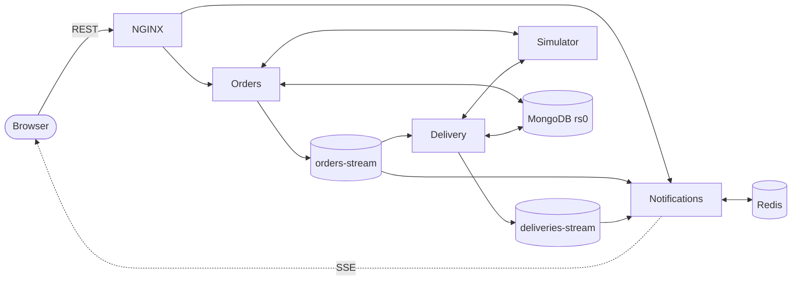
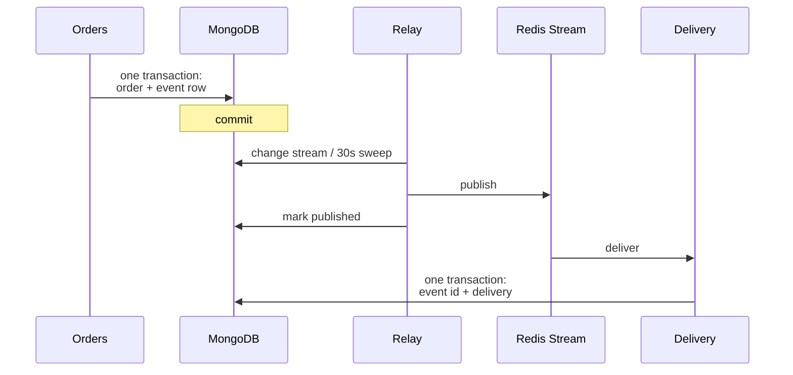

# Design

## Constraints

The design follows from where this runs: a **Raspberry Pi cluster**. A few cores,
a few gigabytes of RAM, one Redis, one MongoDB replica set. That rules out Kafka,
a service mesh, and a tracing backend — not because they are wrong, but because
their operational cost would dwarf the application.

So the rule is: **one piece of infrastructure per job, and only if the job
exists.** Redis was already needed for caching, so it also carries the event bus,
the fanout, and the timers. MongoDB was already a replica set for transactions,
so it also carries the outbox via change streams.



## Why choreography

Services never call each other. An order is written, an event is emitted, and
whoever cares reacts. The properties that buys:

- **Adding a consumer costs nothing.** An analytics service subscribing to
  `orders-stream` requires no change to the orders service.
- **No cascading failure.** Delivery being down does not fail order creation; the
  events wait in the stream.
- **Independent deploys.** Any service can restart without coordinating.

The cost is that there is no single place to read the workflow, and no automatic
rollback across services. That trade is right *here* because the workflow is
short and forward-only. It stops being right the moment money is involved — a
payment that must be refunded when delivery fails needs compensation, which means
a saga and an orchestrator.

## Why Redis Streams

| | Redis Streams | Redis Pub/Sub | RabbitMQ | Kafka |
|---|:---:|:---:|:---:|:---:|
| Persistence | ✅ | ❌ | ✅ | ✅ |
| Consumer groups | ✅ | ❌ | ✅ | ✅ |
| Replay from offset | ✅ | ❌ | ❌ | ✅ |
| Already in the stack | ✅ | ✅ | ❌ | ❌ |
| Ops cost | Low | Low | Medium | High |

Streams give the two things that matter — persistence and consumer groups —
without a new component. The ceiling is real: one Redis process, so throughput
is bounded by one core and retention by RAM. At roughly **10k events/second**, or
when replay beyond a trimmed window is needed, Kafka becomes the correct answer.
That is far above what this system will ever see.

## Delivery guarantees

The chain is deliberately **at-least-once plus deduplication**, not
exactly-once — which does not exist across a database and a broker.



**Nothing is lost.** The event is written in the same transaction as the order,
so it cannot be missing after a commit. A relay publishes it afterwards.

**Nothing is applied twice.** The relay may publish and then die before marking
the row, so an event can arrive again. Consumers record the event id in the same
transaction as their write, and a redelivery hits a unique index and aborts.

**Nothing goes backwards.** Status updates match on their allowed predecessors,
so a replayed or late event matches no document and is dropped.

**Poison messages are quarantined.** Three failures, then the `dead-letters`
stream, with the original payload and error preserved.

**Retries do not double-order.** `POST /orders` accepts an `Idempotency-Key`.
The key is reserved inside the order's transaction, so it is only consumed if
the order is actually created — a rejected order leaves the key usable, and a
client that times out and retries gets its original result back.

The relay uses a change stream for latency and a 30-second sweep for
correctness. The sweep alone is sufficient — it covers a relay that was down, a
publish that failed, and a resume token that aged out of the oplog — so the
change stream can break without threatening delivery.

## What scales, and what does not

**Stateless services scale horizontally.** Orders and delivery are consumer-group
members: adding a replica adds a consumer and the group rebalances. Nothing is
held in process.

**Real-time push needed work to scale.** Notifications holds SSE streams in
memory, but each domain event goes to exactly *one* replica in the shared group.
With three replicas and no session affinity, most updates reached a replica that
had no client for them. The fix is a second stream consumed by a group *per
replica*, so every replica sees every push and delivers to the clients it holds.
Those groups use `NOACK`: persistence is worthless for a live push, because a
replica that was down has no clients to deliver to.

**Timers are durable, not in-process.** An `asyncio.sleep` dies with the process.
Simulation steps are rows in a sorted set claimed atomically by Lua, so a restart
resumes rather than stranding orders.

**What breaks first, in order:**

1. **Redis memory** — streams are trimmed with `MAXLEN`, but retention is still
   RAM. Trimming under a stalled consumer silently drops events, so consumer lag
   is the metric to alert on: every bus reports `stream_group_lag` per stream
   and group, which rises well before trimming starts discarding a backlog.
2. **MongoDB writes** — a single replica set primary takes every write. Read
   replicas help reads; write scaling needs sharding.
3. **The stateful edge** — SSE streams are long-lived connections, so
   notifications is bound by file descriptors and memory per client long before
   CPU.

## Where the bodies are

Honest limitations, rather than a feature list:

- **No authentication.** Any client can create an order. Ordering is the demo.
- **No payments**, which is exactly why no saga is needed yet.
- **Menu reads hit MongoDB** on every request. An obvious cache, deliberately not
  built until there is load to justify invalidation.
- **Tracing needs a collector.** Spans are produced and propagate across
  streams, but nothing collects them unless `OTEL_EXPORTER_OTLP_ENDPOINT` points
  somewhere. Correlation IDs in Loki remain the default way to follow an order.
- **The dead-letter stream has no replay tool.** Inspection is manual.

## Observability

Prometheus scrapes per-service RED metrics, per-stream counters and
`stream_group_lag`. Grafana dashboards ship in the chart. Loki holds structured
logs, each line carrying the `correlation_id` that follows an event across every
service — which is how a single order is followed end to end without a tracing
backend.

Tracing is available but optional. It turns on only when
`OTEL_EXPORTER_OTLP_ENDPOINT` is set, and the `otel` extra can be left
uninstalled entirely. The part that automatic instrumentation cannot do for you
is the stream hop: a publisher writes W3C trace context into the message
envelope and the consumer continues that trace, so an order and the delivery it
causes land in **one** trace rather than several disconnected ones.

## Scaling on backlog

Stream consumers scale on lag, not CPU. They are IO-bound, so a service can be
thousands of messages behind while barely touching a core — CPU would never
trigger. KEDA `ScaledObject`s ship in the chart, disabled by default since they
need KEDA installed:

```yaml
keda:
  enabled: true
```

Notifications is deliberately excluded: it is bound by how many SSE streams it
holds open, so backlog is the wrong signal for it.
